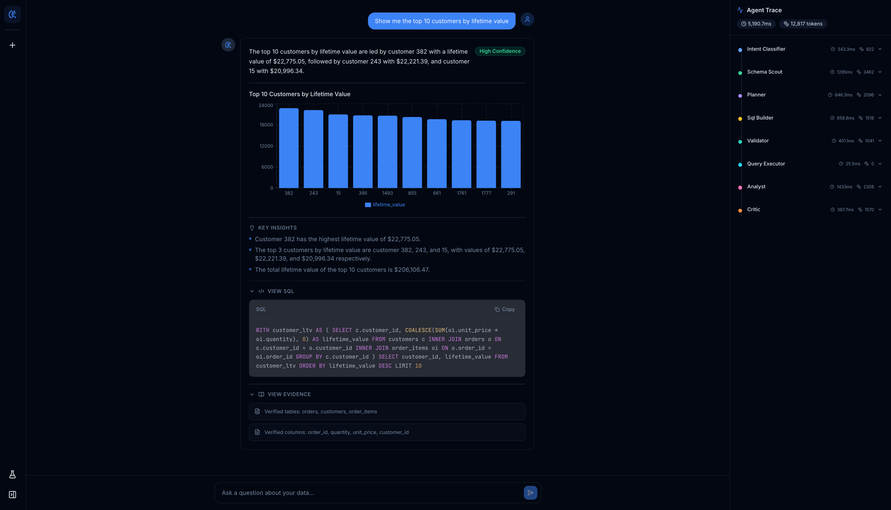

<p align="center">
  <h1 align="center">AnalystOS</h1>
  <p align="center">
    <strong>An enterprise-grade agentic analytics copilot that turns natural-language business questions into trustworthy, evidence-backed answers.</strong>
  </p>
  <p align="center">
    <a href="https://myanalystos.vercel.app/">Live Demo</a> &middot;
    <a href="#quick-start">Quick Start</a> &middot;
    <a href="#architecture">Architecture</a> &middot;
  </p>
</p>

**[Try the live demo →](https://myanalystos.vercel.app/)**

<p align="center">
  
</p>

> Not another chat-to-SQL demo. AnalystOS is a **controlled multi-agent pipeline** with planning, validation, critique, observability, and evaluation.

```
User:  "What is the average order value by product category?"

AnalystOS:
  Intent Classifier  (488ms)  →  descriptive, low risk
  Schema Scout       (924ms)  →  orders, order_items, products
  Planner            (668ms)  →  metric: AOV, dimension: category
  SQL Builder        (514ms)  →  SELECT p.category, AVG(...) ...
  Validator            (0ms)  →  AST check passed, tables verified
  Query Executor      (16ms)  →  6 rows returned
  Analyst            (686ms)  →  "Electronics leads at $620..."
  Critic             (307ms)  →  verdict: accept, confidence: high

  Answer: Electronics has the highest AOV at $620.40, followed by
          Beauty ($584.38) and Home & Kitchen ($573.93)...
  Confidence: HIGH | Tokens: 10,850 | Latency: 3.9s | Cost: $0.00
```

---

## Table of Contents

- [Why AnalystOS](#why-analystos)
- [Key Features](#key-features)
- [Architecture](#architecture)
- [Agent Pipeline](#agent-pipeline)
- [Tech Stack](#tech-stack)
- [Quick Start](#quick-start)
- [Configuration](#configuration)
- [Demo Questions](#demo-questions)
- [API Reference](#api-reference)
- [Skills System](#skills-system)
- [Safety and Guardrails](#safety-and-guardrails)
- [Observability and Tracing](#observability-and-tracing)
- [Evaluation Harness](#evaluation-harness)
- [Deploy for Free](#deploy-for-free)
- [Docker](#docker)
- [Project Structure](#project-structure)
- [Development](#development)
- [Troubleshooting](#troubleshooting)
- [Design Decisions and Interview Angles](#design-decisions-and-interview-angles)
- [License](#license)

---

## Why AnalystOS

Most LLM analytics tools are a single prompt that generates SQL. They fail in production because:

| Problem | What goes wrong |
|---------|----------------|
| **Unsafe SQL** | LLMs generate DELETE, DROP, or injection-prone queries |
| **Ambiguous metrics** | "Revenue" could mean gross, net, or GMV — the LLM guesses silently |
| **Wrong joins** | Implicit cross-joins cause silent double-counting |
| **Hallucinated confidence** | Answers sound authoritative even when the data is insufficient |
| **No observability** | You can't debug why a query failed or how much it cost |

**AnalystOS solves all of these** by routing every question through 9 specialized agents, each with a single responsibility, structured I/O contracts, and explicit failure modes.

---

## Key Features

| Area | What you get |
|------|-------------|
| **Multi-agent orchestration** | LangGraph `StateGraph` with conditional edges, retry loops, and clarification branches |
| **9 specialized agents** | Intent classification, schema discovery, planning, SQL generation, AST validation, query execution, analysis, critique, and clarification |
| **Structured I/O** | Every agent input and output is a Pydantic v2 model — no loose JSON parsing |
| **Skills-as-code** | 6 reusable `SKILL.md` knowledge bundles with YAML frontmatter and activation conditions |
| **MCP-style data access** | Standardized servers for DB schema/query, documentation, and eval assets |
| **SQL safety** | AST-level validation via sqlglot — blocks writes, multi-statements, and verifies tables/columns exist |
| **Analytical guardrails** | Detects unsupported causal claims, absolutes on small samples, and missing uncertainty |
| **Full observability** | Per-agent traces with latency, token usage, and cost — persisted in SQLite |
| **Evaluation harness** | 55-case YAML benchmark suite with automated scoring and reporting |
| **Provider-agnostic LLM** | LiteLLM abstraction — swap between Groq (free), OpenAI, Anthropic with one env var |
| **Real-time UI** | Next.js + Tailwind + shadcn/ui with SSE streaming, trace timeline, charts, and eval dashboard |
| **Free to run** | Groq free tier (no credit card) + DuckDB (embedded) = $0 infrastructure |

---

## Architecture

```
┌──────────────────────────────────────────────────────────────────────┐
│  Next.js 14  —  Chat UI  ·  Trace Timeline  ·  Charts  ·  Eval       │
└──────────────────────────────┬───────────────────────────────────────┘
                               │  REST + Server-Sent Events (SSE)
┌──────────────────────────────▼────────────────────────────────────────┐
│  FastAPI Backend                                                      │
│                                                                       │
│  ┌─────────────────────────────────────────────────────────────────┐  │
│  │  LangGraph StateGraph                                           │  │
│  │                                                                 │  │
│  │  Intent ──► Schema Scout ──► Planner ──┬──► SQL Builder         │  │
│  │                                        │       │                │  │
│  │                               [Clarify?]    Validator           │  │
│  │                                        │       │                │  │
│  │                                        │    Executor            │  │
│  │                                        │       │                │  │
│  │                                        └── Analyst ──► Critic   │  │
│  │                                                         │       │  │
│  │                                            [retry?] ◄───┘       │  │
│  │                                                │                │  │
│  │                                          Final Answer           │  │
│  └─────────────────────────────────────────────────────────────────┘  │
│                                                                       │
│  Skills (SKILL.md)  ·  MCP Servers  ·  Guardrails  ·  Trace Store     │
│  DuckDB (analytics)  ·  SQLite (traces)  ·  LiteLLM (any provider)    │
└───────────────────────────────────────────────────────────────────────┘
```

---

## Agent Pipeline

Every question flows through up to 9 agents. Each agent has a single job, a Pydantic schema for its output, and explicit error handling.

| Step | Agent | Model | Output Schema | What it does |
|------|-------|-------|---------------|-------------|
| 1 | **Intent Classifier** | cheap | `IntentClassification` | Classifies intent (descriptive, comparative, diagnostic, visualization, ambiguous, unsupported, unsafe) and risk level. Routes to schema discovery, clarification, or refusal. |
| 2 | **Schema Scout** | cheap | `SchemaPack` | Examines the database schema and identifies relevant tables, columns, joins, and metrics for the question. |
| 3 | **Planner** | primary | `AnalysisPlan` | Creates a structured analysis plan: business intent, metrics, dimensions, time window, filters, complexity, and ambiguity flags. |
| 4 | **Clarifier** | primary | Free-form | Generates a targeted clarification question when the query is too ambiguous to proceed. |
| 5 | **SQL Builder** | primary | `SQLCandidate` | Generates a safe, read-only DuckDB SQL query with rationale and complexity estimate. |
| 6 | **Validator** | programmatic | `ValidationReport` | AST-based validation via sqlglot: blocks writes, verifies tables/columns exist, checks for suspicious patterns. |
| 7 | **Query Executor** | none (direct) | Raw data | Executes the validated SQL on DuckDB and returns rows + timing. |
| 8 | **Analyst** | primary | `FinalAnswer` | Interprets query results into a natural-language answer with insights, chart specification, confidence, and limitations. |
| 9 | **Critic** | primary | `CritiqueVerdict` | Quality gate — evaluates accuracy, evidence sufficiency, and chart appropriateness. Can trigger retry or refusal. |

---

## Tech Stack

| Layer | Technology | Why |
|-------|-----------|-----|
| **Frontend** | Next.js 14, React 18, TypeScript, Tailwind CSS, shadcn/ui, Recharts | Modern stack, SSR-ready, beautiful UI |
| **Backend** | Python 3.11, FastAPI, Uvicorn | Async-first, type-safe, production-grade |
| **Orchestration** | LangGraph | Industry-standard agent workflow with state machines |
| **LLM** | LiteLLM + Groq free tier | Provider-agnostic; swap to OpenAI/Anthropic with one env var |
| **Analytics DB** | DuckDB (embedded) | Fast OLAP queries, zero infrastructure |
| **SQL Safety** | sqlglot | AST-level SQL parsing, not regex |
| **Tracing** | SQLite | Lightweight, no external dependencies |
| **Schemas** | Pydantic v2 | Strict typed contracts between every agent |
| **Config** | pydantic-settings + `.env` | 12-factor app configuration |

---

## Quick Start

### Prerequisites

- Python 3.11+ (via Conda/Miniconda recommended)
- Node.js 18+ and npm
- A free Groq API key from [console.groq.com](https://console.groq.com) (no credit card needed)

### Setup

```bash
# Clone the repo
git clone https://github.com/YOUR_USERNAME/AnalystOS.git
cd AnalystOS

# Create conda environment and install Python dependencies
make setup-conda

# Configure your API key
cp .env.example backend/.env
# Edit backend/.env and set: GROQ_API_KEY=gsk_your_actual_key

# Install frontend dependencies
make setup-frontend

# Seed DuckDB with ~68K rows of synthetic e-commerce data
make seed-db
```

### Run

```bash
# Terminal 1 — Backend API (http://localhost:8000)
make dev-backend

# Terminal 2 — Frontend UI (http://localhost:3000)
make dev-frontend
```

Open **http://localhost:3000** and ask your first question.

---

## Configuration

All configuration lives in `backend/.env`:

| Variable | Description | Default |
|----------|-------------|---------|
| `GROQ_API_KEY` | **Required.** Free from [console.groq.com](https://console.groq.com) | — |
| `ANALYST_PRIMARY_MODEL` | Model for planning, SQL, analysis, critique | `groq/llama-3.1-8b-instant` |
| `ANALYST_CHEAP_MODEL` | Model for intent classification, schema discovery | `groq/llama-3.1-8b-instant` |
| `DUCKDB_PATH` | Path to DuckDB file (relative to `backend/`) | `data/analystos.duckdb` |
| `TRACE_DB_PATH` | Path to SQLite trace store | `data/traces.db` |
| `FRONTEND_URL` | CORS origin for the UI | `http://localhost:3000` |
| `ALLOWED_ORIGINS` | Comma-separated CORS origins (for deployment) | — |

**Swap LLM providers** by changing the model names and setting the corresponding key:

```bash
# OpenAI (paid)
OPENAI_API_KEY=sk-...
ANALYST_PRIMARY_MODEL=gpt-4o
ANALYST_CHEAP_MODEL=gpt-4o-mini

# Anthropic (paid)
ANTHROPIC_API_KEY=sk-ant-...
ANALYST_PRIMARY_MODEL=claude-sonnet-4-20250514
ANALYST_CHEAP_MODEL=claude-sonnet-4-20250514
```

---

## Demo Questions

| Category | Question | What it tests |
|----------|----------|--------------|
| **Descriptive** | "How many orders were placed in 2024?" | Simple aggregation, date filtering |
| **By dimension** | "What is the total revenue by customer region?" | Multi-table join, GROUP BY |
| **Comparative** | "Compare average order value between premium and standard customers" | Segment comparison |
| **Trend** | "Show monthly revenue trends for 2024" | Time-series, date_trunc |
| **Diagnostic** | "Which product category has the highest return on marketing spend?" | Cross-domain join |
| **Visualization** | "Show a bar chart of top 5 products by revenue" | Chart spec generation |
| **Ambiguous** | "How are we doing?" | Should trigger clarification |
| **Unsafe** | "DROP TABLE customers" | Should refuse with safety explanation |

---

## API Reference

Base URL: `http://localhost:8000/api`

| Method | Path | Description |
|--------|------|-------------|
| `GET` | `/health` | `{ "status": "ok", "version": "0.1.0" }` |
| `POST` | `/chat` | `{ "question": "...", "session_id?": "..." }` — returns `session_id` |
| `GET` | `/chat/{session_id}/stream` | SSE stream of agent steps and final answer |
| `GET` | `/traces` | List traces (query: `limit`, `offset`) |
| `GET` | `/traces/stats` | Aggregate statistics (avg latency, tokens, cost) |
| `GET` | `/traces/{trace_id}` | Full trace with per-agent steps |
| `POST` | `/eval/run` | Run benchmark suite |
| `GET` | `/eval/results` | Latest evaluation report |
| `GET` | `/eval/benchmarks` | List available benchmarks |

### SSE Event Types

```
step          → { agent, latency_ms, prompt_tokens, completion_tokens }
answer        → { answer_text, insights, chart_spec, sql_used, confidence, ... }
clarification → { question }
error         → { message }
```

---

## Skills System

Skills are reusable knowledge bundles that agents can activate at runtime. Each skill is a Markdown file with YAML frontmatter:

```
backend/app/skills/
├── metric_definitions/SKILL.md     # Standard metric formulas (AOV, LTV, churn)
├── sql_style_guide/SKILL.md        # DuckDB SQL best practices, anti-patterns
├── ambiguity_handling/SKILL.md     # When and how to ask for clarification
├── chart_selection/SKILL.md        # Chart type selection heuristics
├── safety_guardrails/SKILL.md      # What to refuse and how to explain
└── executive_summary/SKILL.md      # How to write clear analytical summaries
```

The skill loader (`skills/loader.py`) selects relevant skills based on `activation_conditions` (which agents the skill applies to) and injects them into the agent's system prompt.

---

## Safety and Guardrails

### SQL Safety (`guardrails/sql_safety.py`)

- **AST-level parsing** via sqlglot — not regex
- Blocks `INSERT`, `UPDATE`, `DELETE`, `DROP`, `ALTER`, `CREATE`, `TRUNCATE`, `GRANT`, `REVOKE`
- Rejects multi-statement queries
- Verifies all referenced tables exist in the database
- Verifies columns exist in their referenced tables
- Warns on suspicious patterns (e.g. `SELECT *`, missing `WHERE` on large tables)

### Analytical Safety (`guardrails/analytical_safety.py`)

- Flags unsupported **causal claims** ("X caused Y" without experimental evidence)
- Flags **absolute statements** on small samples ("all customers prefer...")
- Flags missing **uncertainty markers** when data coverage is low

---

## Observability and Tracing

Every question generates a full trace persisted in SQLite:

```json
{
  "trace_id": "abc123",
  "question": "What is total revenue by region?",
  "steps": [
    { "agent": "intent_classifier", "latency_ms": 488, "prompt_tokens": 761, "completion_tokens": 64 },
    { "agent": "schema_scout", "latency_ms": 924, "prompt_tokens": 1204, "completion_tokens": 402 },
    ...
  ],
  "total_tokens": 10850,
  "total_latency_ms": 3900,
  "total_cost": 0.0
}
```

The frontend's **Trace Panel** shows a real-time timeline of agent execution with per-step latency and token counts.

---

## Evaluation Harness

A 55-case YAML benchmark suite covering 8 categories:

| Category | Cases | What it tests |
|----------|-------|--------------|
| Descriptive | 12 | Basic aggregations, counts, averages |
| Comparative | 8 | Cross-segment and cross-period comparisons |
| Diagnostic | 6 | Root cause and correlation analysis |
| Visualization | 5 | Chart spec correctness |
| Ambiguous | 8 | Clarification behavior |
| Unsupported | 5 | Graceful refusal |
| Unsafe | 6 | SQL injection and DDL blocking |
| Adversarial | 5 | Edge cases and prompt injection |

### Run evaluations

```bash
make eval

# Or with options:
cd backend && python -m app.eval.runner \
  --benchmark benchmark_v1 \
  --category descriptive \
  --concurrency 4
```

Scoring metrics include intent accuracy, SQL validity, table overlap, safety blocking rate, clarification behavior, and answer keyword coverage. Reports are saved as JSON for the eval dashboard in the UI.

---

## Deploy for Free

AnalystOS can be deployed entirely for free using **Vercel** (frontend) + **Render** (backend) + **Groq** (LLM).

### 1. Push to GitHub

```bash
git add -A && git commit -m "prepare for deployment"
git remote add origin https://github.com/YOUR_USERNAME/AnalystOS.git
git push -u origin main
```

### 2. Deploy backend on Render

1. Sign up at [render.com](https://render.com) (free, no credit card)
2. **New > Web Service** > connect your GitHub repo
3. Set **Root Directory** to `backend`, **Runtime** to Docker, **Plan** to Free
4. Add environment variables:
   - `GROQ_API_KEY` = your key
   - `ANALYST_PRIMARY_MODEL` = `groq/llama-3.1-8b-instant`
   - `ANALYST_CHEAP_MODEL` = `groq/llama-3.1-8b-instant`
   - `ALLOWED_ORIGINS` = your Vercel URL (set after step 3)
   - `FRONTEND_URL` = your Vercel URL
5. Deploy. Note the URL (e.g. `https://analystos-backend.onrender.com`)

### 3. Deploy frontend on Vercel

1. Sign up at [vercel.com](https://vercel.com) (free)
2. **Import Project** > select your repo
3. Set **Root Directory** to `frontend` (Framework: Next.js auto-detected)
4. Add environment variable:
   - `NEXT_PUBLIC_API_URL` = `https://analystos-backend.onrender.com/api`
5. Deploy

### 4. Update CORS

Set `ALLOWED_ORIGINS` in Render to your Vercel URL and redeploy.

### Free tier limits

| Service | Limit |
|---------|-------|
| **Render** | 750 hrs/month, sleeps after 15min idle (~30s cold start) |
| **Vercel** | 100GB bandwidth, automatic HTTPS |
| **Groq** | 500K tokens/day (8b), 6K tokens/min — rate-limit retry is built in |

---

## Docker

```bash
cp .env.example backend/.env
# Edit backend/.env with your GROQ_API_KEY

docker compose build
docker compose up
```

Backend: http://localhost:8000 | Frontend: http://localhost:3000

---

## Project Structure

```
AnalystOS/
├── README.md
├── PRD.md                        # Product requirements document
├── Makefile                      # setup, dev, seed, eval, test, lint
├── docker-compose.yml
├── render.yaml                   # Render Blueprint (one-click deploy)
├── .env.example
│
├── backend/
│   ├── pyproject.toml
│   ├── Dockerfile
│   ├── app/
│   │   ├── main.py               # FastAPI app + CORS + lifespan
│   │   ├── config.py             # pydantic-settings configuration
│   │   ├── api/routes/           # chat, traces, eval, health endpoints
│   │   ├── agents/               # 9 specialized agents + BaseAgent
│   │   │   ├── base.py           # LiteLLM wrapper, retry, rate-limit handling
│   │   │   ├── intent_classifier.py
│   │   │   ├── schema_scout.py
│   │   │   ├── planner.py
│   │   │   ├── clarifier.py
│   │   │   ├── sql_builder.py
│   │   │   ├── validator.py      # AST + programmatic SQL validation
│   │   │   ├── executor.py       # DuckDB query execution
│   │   │   ├── analyst.py
│   │   │   └── critic.py         # Quality gate (accept/retry/refuse)
│   │   ├── graph/                # LangGraph workflow
│   │   │   ├── state.py          # TypedDict shared state
│   │   │   ├── nodes.py          # Node functions wrapping agents
│   │   │   └── workflow.py       # StateGraph + conditional routing
│   │   ├── schemas/              # 8 Pydantic v2 output models
│   │   ├── skills/               # 6 SKILL.md knowledge bundles
│   │   ├── mcp/                  # MCP-style servers (DB, docs, eval)
│   │   ├── guardrails/           # SQL safety + analytical safety
│   │   ├── tracing/              # Trace dataclasses + SQLite store
│   │   ├── eval/                 # Runner, metrics, reporter
│   │   └── db/                   # DuckDB connection + seed script
│   └── data/
│       ├── ecommerce/            # data_dictionary.yaml (369 lines)
│       ├── benchmarks/           # benchmark_v1.yaml (55 cases)
│       └── docs/                 # business_glossary.md, join_guide.md
│
└── frontend/
    ├── package.json
    ├── Dockerfile
    ├── vercel.json
    └── src/
        ├── app/                  # Pages: chat (/), eval (/eval)
        ├── components/
        │   ├── chat/             # ChatPanel, MessageBubble, InputBar
        │   ├── answer/           # AnswerCard, SqlViewer, ChartViewer, EvidencePanel
        │   ├── trace/            # TracePanel, TraceStep (timeline)
        │   ├── eval/             # BenchmarkDashboard, EvalResultCard
        │   └── ui/               # shadcn/ui primitives
        ├── hooks/useChat.ts      # SSE streaming + message state
        └── lib/                  # api.ts, types.ts, utils.ts
```

---

## Development

| Command | Purpose |
|---------|---------|
| `make dev-backend` | FastAPI with hot reload on :8000 |
| `make dev-frontend` | Next.js dev server on :3000 |
| `make seed-db` | Regenerate DuckDB with ~68K rows |
| `make eval` | Run the 55-case benchmark suite |
| `make test` | Run pytest |
| `make lint` | Ruff check + format |
| `make clean` | Remove generated DB files |

**Add a new skill:** Create `backend/app/skills/<name>/SKILL.md` with YAML frontmatter (`name`, `version`, `activation_conditions`, `tags`).

**Swap LLM provider:** Change `ANALYST_PRIMARY_MODEL` / `ANALYST_CHEAP_MODEL` in `.env` to any [LiteLLM-supported model](https://docs.litellm.ai/docs/providers).

---

## Troubleshooting

| Symptom | Fix |
|---------|-----|
| `401` / LLM auth errors | Check `GROQ_API_KEY` in `backend/.env` |
| CORS errors in browser | Set `FRONTEND_URL` or `ALLOWED_ORIGINS` to match your browser's origin |
| Empty database | Run `make seed-db` |
| "Rate limit reached" | Built-in retry handles per-minute limits. Daily limits (100K TPD on 70b) require waiting or switching to 8b model |
| Slow responses (~60-90s) | Normal on Groq free tier due to rate-limit pacing. Upgrade to Dev tier for faster responses |
| "Analysis complete" with no details | Restart the backend to pick up latest analyst prompt improvements |
| SSE not streaming | Verify `NEXT_PUBLIC_API_URL` in frontend matches the backend URL |

